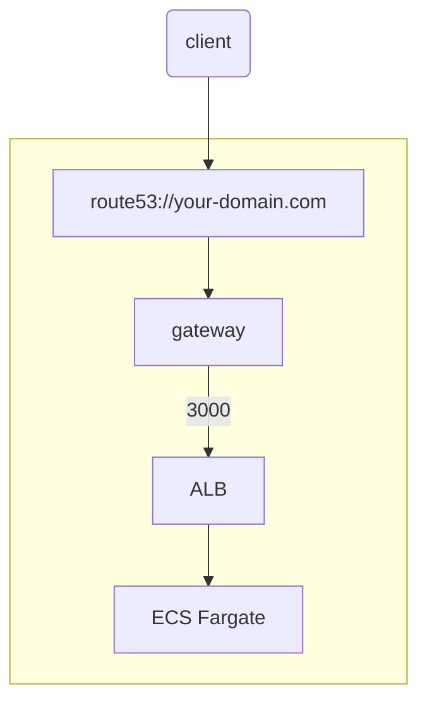
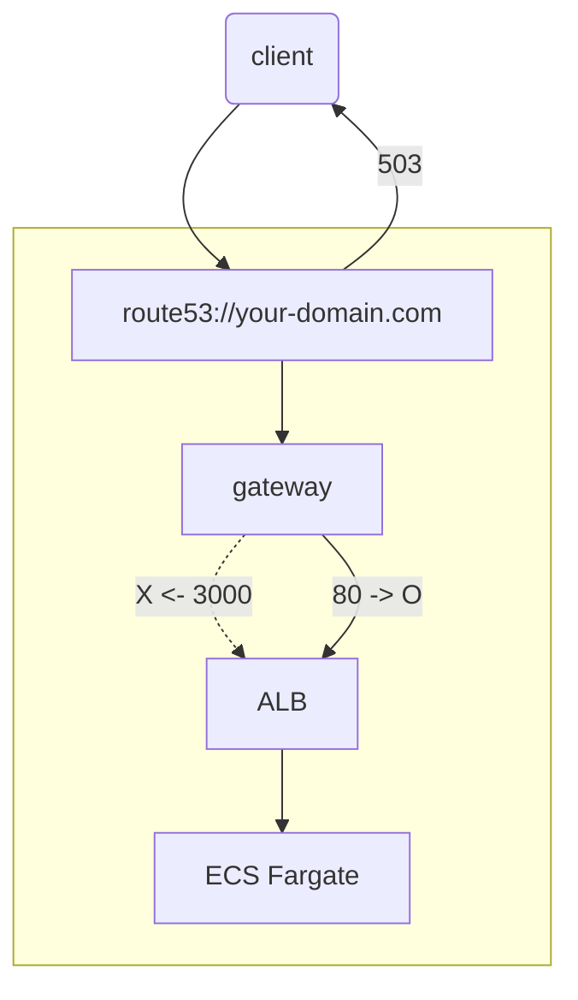
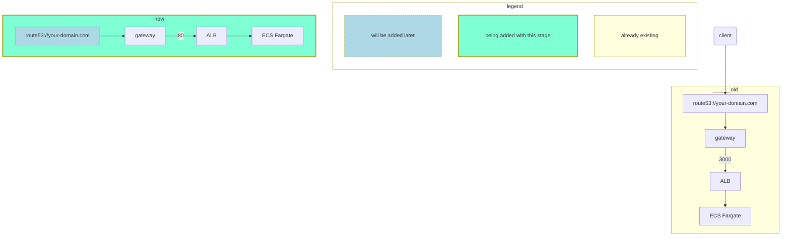
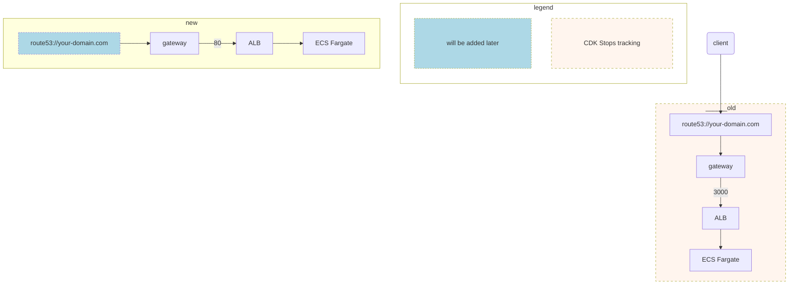
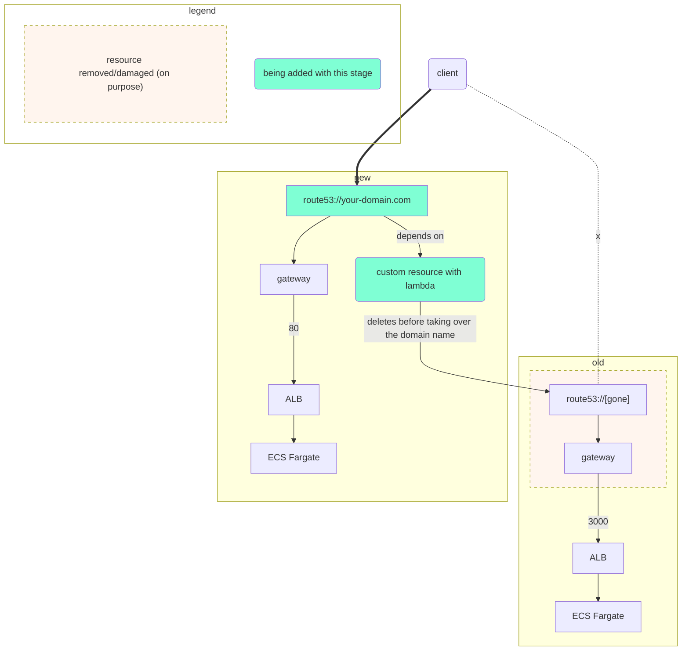
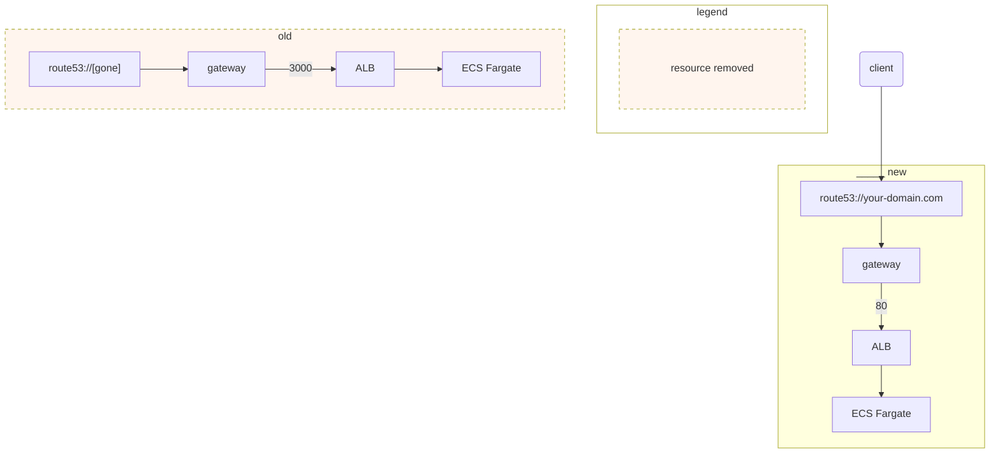

# aws/api-gateway/swap-impaired

## Prerequisites
[Install Earthly and its pre-requisites](https://earthly.dev/get-earthly)

## How to Run

`make deploy-[branch]-[stage]` to deploy to AWS via CDK.
Read [Makefile](./Makefile) for examples.

## Branch and Stages

### Naive

Run `make deploy-naive-all` if in a hurry. If not `make-deploy-naive-[0-1]` in order.

#### Stage 0
Deploy an API Gateway and an ECS Fargate cluster in a simplest form with port 3000.


#### Stage 1
Change the port to 80, this should suppose to work but as of writing this, it starts responding with 503 instead.



### LinkSwap

Run `make deploy-linkswap-all` if in a hurry. If not `make-deploy-linkswap-[0-1]` in order.

Basically same as Naive approach but except it also replaces VpcLink with a new one when changing the port at the same time.
This is a much simpler and better way then Surgery approach below that is newly discovered after initial Surgery approach. So we can all avoid Surgery approach now.

_Although this is a better hack but still a hack. And not sure if this is a guaranteed way to work every single time but it worked with several tests of mine._

### Surgery

When naive approach doesn't work as expected, we can do a "surgery" to remove the old one and introduce the new one to minimize down time and still satistfy CDK without having to manually manipulate resources and import the new states.

Run `make deploy-surgery-all` if in a hurry. If not `make-deploy-surgery-[0-1]` in order.

_Actually involving with domain is disabled by default so that you can still run this without having to deal with domain._

In case to test with domain as well, do `const involveDomain = true;` at [cdk/swap-impaired/lib/gateway-to-fargate.ts](./cdk/swap-impaired/lib/gateway-to-fargate.ts) and use your own (testable) domain and make sure domain ownership and hosted zone in route53 is already prepared (and testing code should change to use the custom domain as well).

_If you don't use custom domain at all and only rely on AWS generated gateway domain, this surgery become a lot simpler but I left it as a full blown "surgery" just to daemonstrate the essense of it._

#### Stage 0
Pretty much same as Naive stage 0.
#### Stage 1
Prepare a new gateway (with port 80) that will replace the old one.


#### Stage 2
Stop tracking some resources from old gateway.
- so that it doesn't fight with the new gateway creating conflictable resources (domain related ones)
- this comes with the cost of having to clean up some resources manually though



#### Stage 3
- remove old domain via CustomResource (via Lambda) that deletes DomainName and ARecord using AWS API
- connect the domain to the new gateway
- there will be temporary downtime since this involves with Route53 to be deleted briefly




#### Stage 4

Now that the new gateway is handling the traffic, old one is not necessary so it gets deleted in this stage.

_manual deletion of some resources still required after this step_



### Reset
This is just a convinient way to start over without having to delete everything unnecessarily since deleting and recreating vpc takes some time.

You can use this to change branches between _Naive_ and _Surgery_ since without it will result in a messy state.

#### No Stage
Reset Branch has no stage so just run `make deploy-reset`.


The result will be similar to below.

```bash
# after deploying each stage, the result will be shared like below

sleep 1 && curl -s -o /dev/null -w "%{http_code}\n" https://a1b2c3d4e5.execute-api.ca-central-1.amazonaws.com
200 # or 503

# repeate 5 times
```

## Clean Up

`make destroy`
