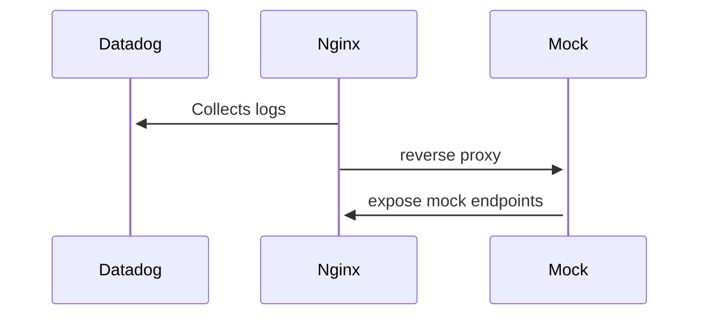
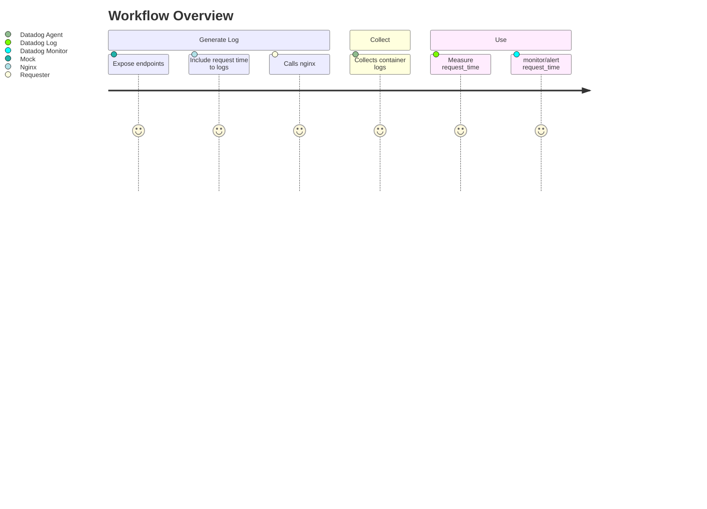

# datadog/nginx-log-request-time

## what

### Component Relationships

### Workflow

## why
a quick setup to be able to play with `request time` for:
- https://www.datadoghq.com/blog/how-to-monitor-nginx-with-datadog/#alerting-on-request-processing-time
- https://docs.datadoghq.com/monitors/create/types/log/

## how
- `make up` to run a mock server and nginx and requester to generate nginx logs
- `make dd` to start collecting
  - read `./.envrc` for information on exporting `DATADOG_API_KEY`
  - FYI, this will send logs from any container in case you run other containers at the same time
